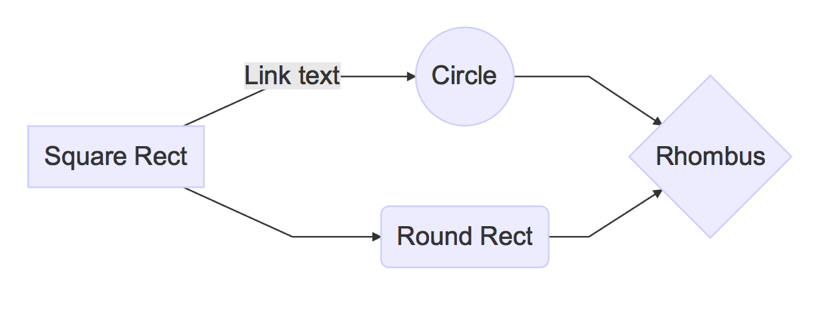
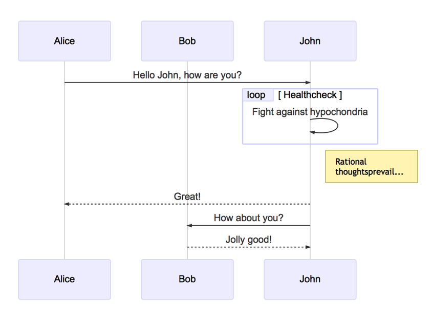
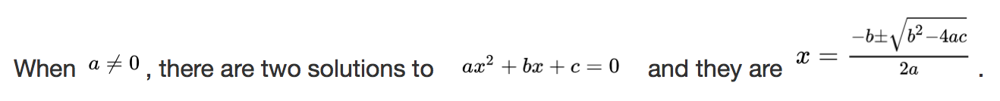
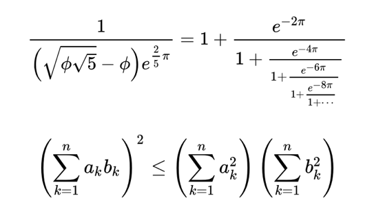

# Evermark

[![NPM version][npm-image]][npm-url]
[![Build Status][build-image]][build-url]
[![Windows Build Status][build-image-win]][build-url-win]
[![Coverage Status][coverage-image]][coverage-url]
[![Dependency Status][david-image]][david-url]
[![Dependency Status][david-dev-image]][david-dev-url]

[npm-image]: https://img.shields.io/npm/v/evermark.svg
[npm-url]: https://npmjs.org/package/evermark
[build-image]: https://travis-ci.org/akuma/evermark.svg?branch=master
[build-url]: https://travis-ci.org/akuma/evermark
[build-image-win]: https://ci.appveyor.com/api/projects/status/qy14tkl3qk8f5nl3/branch/master?svg=true
[build-url-win]: https://ci.appveyor.com/project/akuma/evermark/branch/master
[coverage-image]: https://coveralls.io/repos/github/akuma/evermark/badge.svg?branch=master
[coverage-url]: https://coveralls.io/github/akuma/evermark?branch=master
[david-image]: https://david-dm.org/akuma/evermark.svg
[david-url]: https://david-dm.org/akuma/evermark
[david-dev-image]: https://david-dm.org/akuma/evermark/dev-status.svg
[david-dev-url]: https://david-dm.org/akuma/evermark#info=devDependencies

> A command line tool for syncing markdown notes to Evernote :elephant:

Some features:

- [x] Supports publishing markdown notes to evernote
- [x] Supports unpublishing markdown notes from evernote
- [x] Supports adding notebook and tags
- [x] Supports code highlight, tables and inserting images
- [x] Supports todo-list and LaTeX expressions
- [x] Supports flow charts, sequence diagrams and gant diagrams

-------------------

## Install

```bash
npm install -g evermark
```

## Commands

### Initialize Evermark Folder

Initialize **Evermark** folder, save settings to file `evermark.json`。

```bash
evermark init <destination>
```

1. First, follow the prompt to select whether you are using Evernote International or 印象笔记.
1. Then login with your account from automatically opened page to generate `developerToken` and copy it.
1. Finally, according to the prompt paste the copied `developerToken`.

The urls to generate `developerToken`:

- [Evernote International](https://www.evernote.com/api/DeveloperToken.action)
- [印象笔记](https://app.yinxiang.com/api/DeveloperToken.action)

### View or Modify the Configuration

```bash
evermark config [name] [value]
```

### Add Note

Create a empty markdown note in the `notes` directory of the **Evermark** folder.

```bash
evermark new <title>
```

### Publish Notes

Publish markdown notes to Evernote or update the published notes.

```bash
evermark publish <file_or_directory>
```

### Unpublish Notes

Delete the Evernote note which corresponding the markdown note, but the markdown note will not be deleted.

```bash
evermark unpublish <file_or_directory>
```

### View Help

```bash
evermark help [command]
```

## The Supported Markdown Syntax

### Headers

```
# H1
## H2
### H3
#### H4
##### H5
###### H6
```

### Emphasis

```
*This text will be italic*
_This will also be italic_

**This text will be bold**
__This will also be bold__

~~This text will be crossed~~

_You **can** combine ~~them~~_
```

### Sups & Subs

```
19^th^
H~2~O
```

### Emoji

```
:smile: :heart: :sunny: :watermelon: :cn:
```

### Links

```
http://github.com - automatic!
[GitHub](http://github.com)
```

### Blockquotes

```
As Kanye West said:

> We're living the future so
> the present is our past.
```

### Lists

#### Unordered

```
- Item 1
- Item 2
  - Item 2a
  - Item 2b
```

#### Ordered

```
1. Item 1
1. Item 2
1. Item 3
   - Item 3a
   - Item 3b
```

### Task Lists

```
- [x] Write blog post with :heart:
- [x] Create sample **gist**
- [ ] Take screenshots for blog post
```

### Tables

```
First Header | Second Header
------------ | -------------
Content from cell 1 | Content from cell 2
Content in the first column | Content in the second column
```

### Images

```


```

### Inline Code

```
This is an inline code: `var example = true`
```

### Block Code

    ```js
    console.log('Hello world!')
    ```

### Diagrams

**Evermark** supports flow charts, sequence diagrams and gant diagrams by using [mermaid](https://github.com/knsv/mermaid).<br>
Please see the [mermaid docs](http://knsv.github.io/mermaid/) for more details.

#### Flow Diagrams

    ```
    graph LR
        A[Square Rect] -- Link text --> B((Circle))
        A --> C(Round Rect)
        B --> D{Rhombus}
        C --> D
    ```



#### Sequence Diagrams

    ```
    sequenceDiagram
        participant Alice
        participant Bob
        Alice->>John: Hello John, how are you?
        loop Healthcheck
            John->>John: Fight against hypochondria
        end
        Note right of John: Rational thoughts<br/>prevail...
        John-->>Alice: Great!
        John->>Bob: How about you?
        Bob-->>John: Jolly good!
    ```



#### Gantt Diagrams

    ```
    gantt
        title A Gantt Diagram

        section Section
        A task           :a1, 2014-01-01, 30d
        Another task     :after a1  , 20d

        section Another
        Task in sec      :2014-01-12, 12d
        anther task      : 24d
    ```


### Math Equations

**Evermark** supports LaTeX expression for math.

#### Inline Equations

```
When $a \ne 0$, there are two solutions to $ax^2 + bx + c = 0$ and they are
$x = {-b \pm \sqrt {b^2-4ac} \over 2a}$.
```



#### Block Equations

```
$$
\displaystyle \frac{1}{\Bigl(\sqrt{\phi \sqrt{5}}-\phi\Bigr) e^{\frac25 \pi}} = 1+\frac{e^{-2\pi}} {1+\frac{e^{-4\pi}} {1+\frac{e^{-6\pi}} {1+\frac{e^{-8\pi}} {1+\cdots} } } }
$$

$$
\displaystyle \left( \sum_{k=1}^n a_k b_k \right)^2 \leq
\left( \sum_{k=1}^n a_k^2 \right) \left( \sum_{k=1}^n b_k^2 \right)
$$
```



### Raw HTML

```
<div style="color: red;">This is a <strong>html</strong> code.</div>
```

### Other Syntax

#### Notebooks & Tags

**Evermark** add @(Notebook)[tag1|tag2|tag3] syntax to select notebook and set tags for the note.

#### Title

**Evermark** would use the first heading encountered as the note title.

## License

[MIT](LICENSE)
